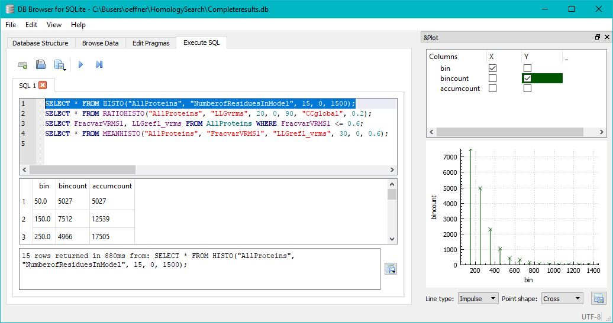
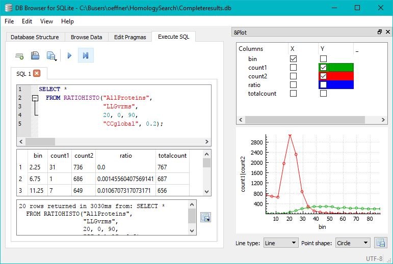
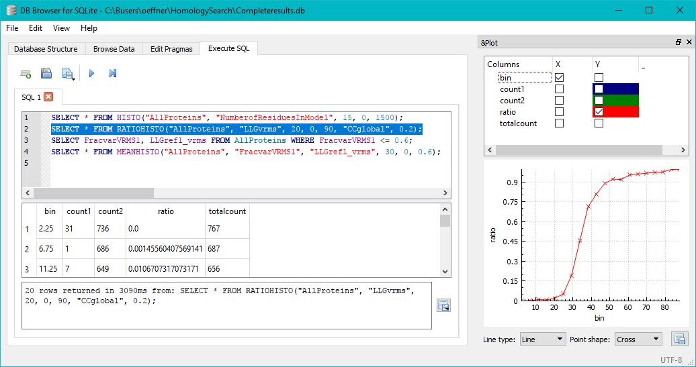
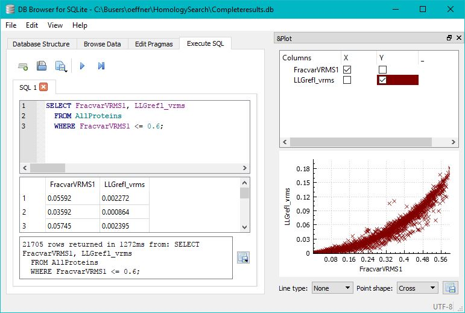
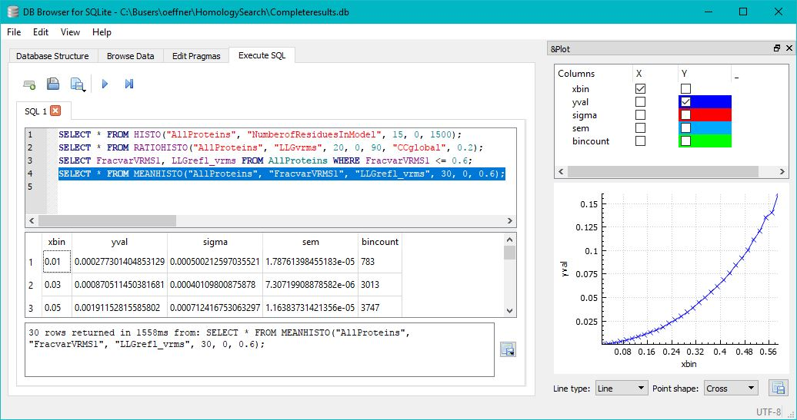

# SQLiteHistograms
An SQLite extension library for creating histogram tables, tables of ratio between histograms and  interpolation 
tables of scatter point tables.

This SQLite extension library is based on the 'ext/misc/series.c example from the SQLite source files. 
It uses the virtual table feature of SQLite to generate tables on the fly.

The library contains three extensions: HISTO for calculating histograms of data, RATIOHISTO for calculating 
ratios of two histograms and MEANHISTO for calculating interpolated values of 2D scatter data.

Histogram example: 

The SQLite table, "AllProteins", contains a column labelled "NumberofResiduesInModel". Rows in the table are labelled with this
number which goes up to about 1500. A histogram can be computed using the extension and the statement: 
  SELECT * FROM HISTO("AllProteins", "NumberofResiduesInModel", 15, 0, 1500);
In the SQLitebrowser the result can be visualised graphically as below:

Ratios of histograms example: 

The SQLite table, "AllProteins", contains a column labelled "LLGvrms". It also has a column, "CCglobal", which is correlated 
to the values in "LLGvrms" in the sense that whenever values of CCglobal are below 0.2 the corresponding LLGvrms value is 
below 50. Two different histograms, "count1" and "count2", can be produced when issuing the statement:
   SELECT * FROM RATIOHISTO("AllProteins", "LLGvrms", 20, 0, 90, "CCglobal", 0.2);
as illustrated below:

Although the two histograms peak at different bin values this can be better illustrated by computing the ratio of the "count2" 
histogram divided by the total count. These values are stored in the "ratio" column which for this particular table 
happens to be a sigmoidal curve as illustrated below:

Interpolated values from scatter data example:

The SQLite table, "AllProteins", contains two columns labelled "FracvarVRMS1" and "LLGrefl_vrms" respectively. These can be
illustrated in the scatter plot below with the following statement:
  SELECT FracvarVRMS1, LLGrefl_vrms FROM AllProteins WHERE FracvarVRMS1 <= 0.6;

For the "AllProteins" table there is clearly a nonlinear dependency of the LLGrefl_vrms values with respect to FracvarVRMS1. 
This can be illustrated with the following statement:
  SELECT * FROM MEANHISTO("AllProteins", "FracvarVRMS1", "LLGrefl_vrms", 30, 0, 0.6); 
which produces the table that is visualised below:

## Compile on Windows with Visual Studio 2015

cl /Fohelpers.obj /c helpers.cpp /EHsc ^
 && cl /Foratiohistogram.obj /c ratiohistogram.cpp /EHsc ^
 && cl /Fohistogram.obj /c histogram.cpp /EHsc ^
 && cl /Fomeanhistogram.obj /c meanhistogram.cpp /EHsc ^
 && cl /FoRegistExt.obj /c RegistExt.cpp /EHsc ^
 && link /DLL /OUT:histograms.dll helpers.obj RegistExt.obj meanhistogram.obj histogram.obj ratiohistogram.obj

With debug info:

cl /Fohelpers.obj /c helpers.cpp /DDEBUG  /ZI /EHsc ^
 && cl /Foratiohistogram.obj /c ratiohistogram.cpp /DDEBUG  /ZI /EHsc ^
 && cl /Fomeanhistogram.obj /c meanhistogram.cpp /DDEBUG  /ZI /EHsc ^
 && cl /Fohistogram.obj /c histogram.cpp /DDEBUG  /ZI /EHsc ^
 && cl /FoRegistExt.obj /c RegistExt.cpp  /DDEBUG  /ZI /EHsc ^
 && link /DLL /DEBUG /debugtype:cv /OUT:histograms.dll helpers.obj meanhistogram.obj RegistExt.obj histogram.obj ratiohistogram.obj

## Compile on Linux with g++

 g++ -fPIC -lm -shared histogram.cpp helpers.cpp meanhistogram.cpp ratiohistogram.cpp RegistExt.cpp -o libhistograms.so

## From the sqlite commandline load the extension

 on Windows:
 
 sqlite> .load histograms.dll
 
 on Linux:
 
 sqlite> .load ./histograms.so

